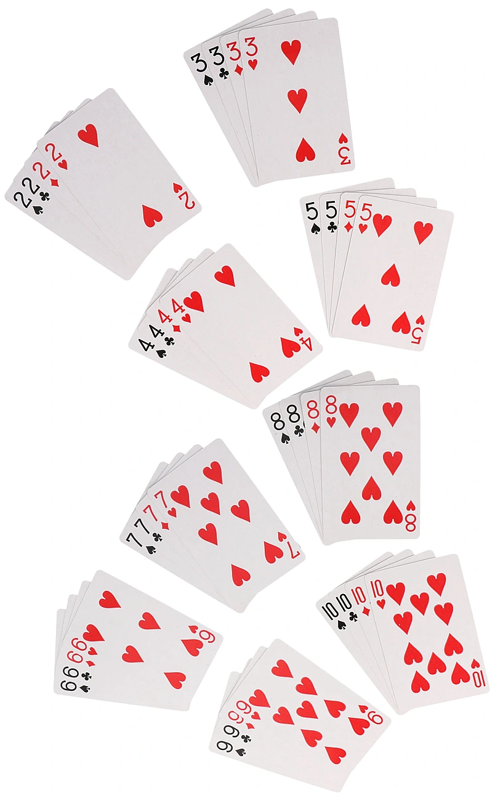

# T306-CSS_ADV
## -------INFO

1. HTML5 ( znaczniki semantyczne )
2. CSS display ( inline, block, inline-block, none )
3. CSS opacity
4. CSS Position (absolute, relative, fixed, sticky)
5. Z-Index
6. CSS Transform

```html
<!DOCTYPE html>
<html lang="en">
<head>
    <meta charset="UTF-8">
    <meta http-equiv="X-UA-Compatible" content="IE=edge">
    <meta name="viewport" content="width=device-width, initial-scale=1.0">
    <title>Card</title>
    <style>
        #container{
            position:absolute;
            top:50%;
            left:50%;
            transform:translate(-50%,-50%);
        }
        .card{
            position:relative;
            border-radius:10px;
            background:white;
            box-shadow: 3px 3px 10px #0005;
            width:7em;
            height:10em;
        }
        .corner{
            padding:.5em;
            position:absolute;
        }
        .cornerT{
            top:0;
            left:0;
        }
        .cornerB{
            bottom:0;
            right:0;
        }
        .flip{
            transform:rotate(180deg);
        }
        .center{
            font-size:3em;
            position:absolute;
            top:50%;
            left:50%;
            transform:translate(-50%,-50%)
        }
    </style>
</head>
<body>
    <div id="container">
        <div class="card">
            <div class="front">
                <div class="corner cornerT"> <!-- gorny naroznik -->
                    <div>2</div>
                    <div>&spades;</div>
                </div>
                <div class="center"> <!-- srodek -->
                    <div class="half">&spades;</div> <!-- gorna polowka -->
                    <div class="half bottom flip">&spades;</div> <!-- dolna polowka -->
                </div>
                <div class="corner cornerB flip"> <!-- dolny naroznik -->
                    <div>2</div>
                    <div>&spades;</div>
                </div>
            </div>
        </div>
    </div>
</body>
</html>
```


```
ZADT30401
Przygotuj stronę na podstawie załączonego mockupu (Semantic.jpg, Semantic_mobile.jpg) używając znaczników semantycznych. 
Wysokość sekcji 100% viewportu. Powrót na górę (trójkąt) wykonać przy pomocy CSS.

ZADT30502
Wycentrować dowolny element na stronie w pionie i w poziomie (wymagana znajomość co najmniej dwóch sposobów). Stwórz dwie strony.

ZADT30503
Wyświetl trzy różne karty do gry na środku strony (w pionie i w poziomie) zbudowane z dwóch elementów (front i back). Kolory/Symbole wpisać w kod html (nie grafiki).
skala ocen (ponizej podano wymagane karty aby zdobyc ocene): 
mn - A,2
dst - A,2,3
db - 3,4,5
bdb - 5,6,7
cel - 5,6,7,8,9,10 (wraz z odwrócona polowa)

ZADT30504
Ustaw cztery różne kartry tak aby na siebie nachodziły i mozliwe było ich ustawienie jak na poniższej ilustracji. Zadanie dodatkowe: zastosuj efekt rozkładania kart po najechaniu kursorem (hover). Dwa stany: karty złożone i karty rozłożone.

ZADT30505
Przygotuj skrypt pozwqalający na przeniesienie na górę stosu klikniętej karty.
```



https://dev.to/kiranrajvjd/the-ultimate-css-background-pattern-resource-20m8

### --------Links
https://github.com/T3iL/T303-CSS

GOOGLE DRIVE: https://drive.google.com/drive/folders/1OqTcjwr_qAdTPO-dThxUOd3ooTTOlzgp?usp=sharing

https://cdnjs.cloudflare.com/ajax/libs/font-awesome/4.7.0/css/font-awesome.min.css

https://www.htmlsymbols.xyz/games-symbols

https://www.w3.org | https://validator.w3.org | https://www.php.net/manual/en/
### --------Repositiories
https://www.w3schools.com | https://stackoverflow.com | https://css-tricks.com |
### --------On line editors
https://codepen.io/ | https://codesandbox.io/ | https://jsfiddle.net/ |
### ---------Assets
https://cdnjs.com/ | https://fontawesome.com | http://fontello.com/ | https://fonts.google.com/ | https://www.flaticon.com/
### ---------Stock Img
https://www.pexels.com/ | https://unsplash.com | https://pixabay.com
### ---------Tuts
https://www.youtube.com/watch?v=1Rs2ND1ryYc
https://www.youtube.com/watch?v=J35jug1uHzE
https://www.youtube.com/watch?v=ieTHC78giGQ
### ---------License
[MIT](https://choosealicense.com/licenses/mit/)
